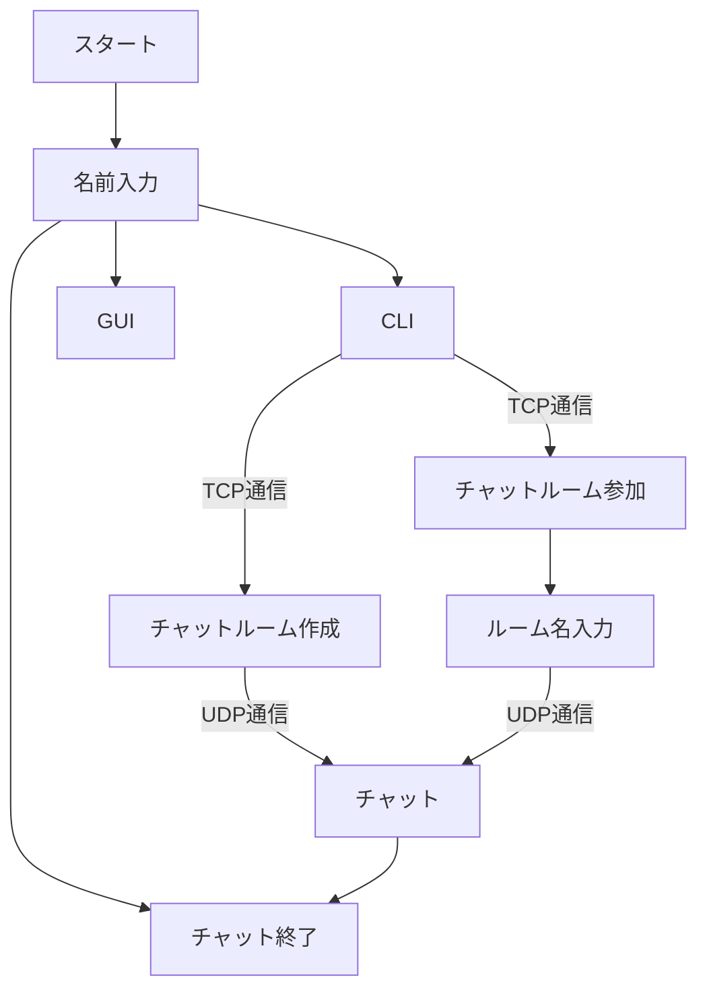
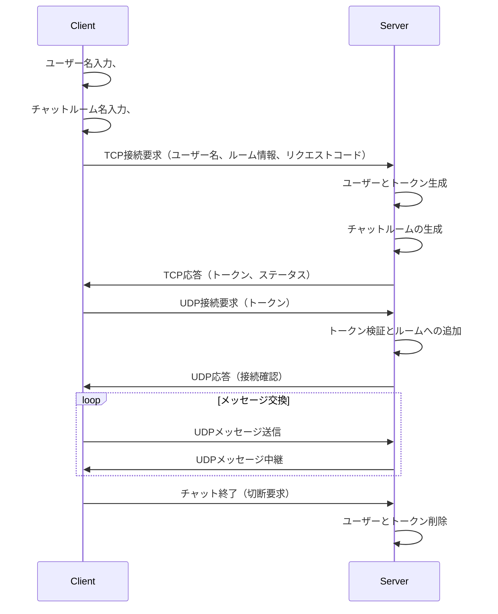
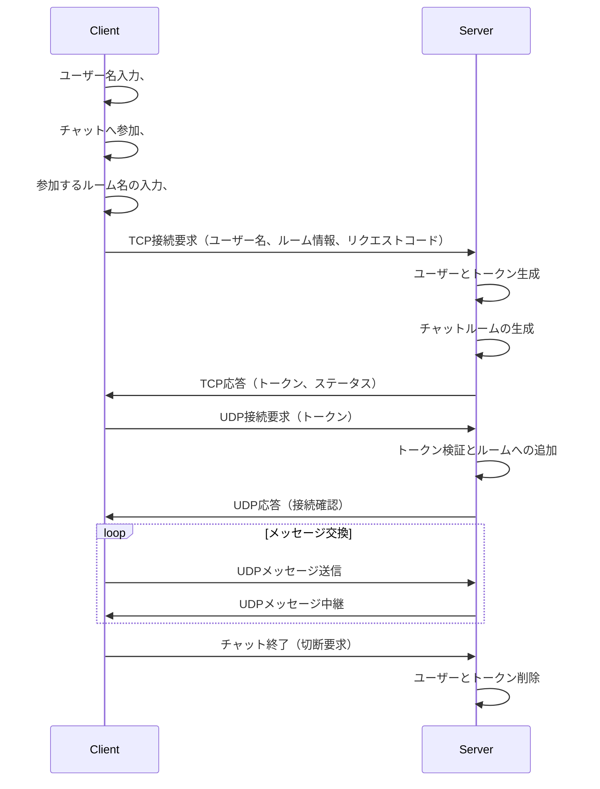

# 開発議事録 (11/25)

## 開発期間
- 2022年11月25日(土) 〜 2022年12月9日(土)

## 決めたこと
### プロジェクトの概要
- オンラインチャットアプリケーションを開発
- CLIの対話形式を想定

### 今後の開発想定
- stage1(必須)
  - 各自で開発して基本的なTCPとUDPについて学ぶ
  - 良さげなメンバーのコードを採用してstage2へ進む
  - 理想は3~4日程度で達成したい
- stage2(必須)
  - ここから本格的なチーム開発
  - 必要であれば各種設計なども行う
- stage3(追加)
  - 時間が余れば着手

### MTGスケジュール
- 火曜日 20:00
- 木曜日 20:00
- 土曜日 10:00

### gitでの開発について
- Git-flowを採用
- 承認は最低1つ必要(できる限り全員レビューを心がける)
- マージはPR発行者が行う(mainブランチへのマージはMTGとかでやった方が良いかも？)
- PRする際は必ず最新developの内容を反映させてから行う(本番マージでコンフリクトを起こさないため)
- [PRはこちらのフォーマットを参照](https://github.com/recursion-team-v/team-v-devlog/blob/main/github_tutorial.md)

### 開発ツール
- flake8をコードフォーマッターとして使用
- 開発環境はUbuntuで統一
- Pythonバージョン3.1以上

## タスク
**[@sei](https://github.com/takatokawazu)**
- [#issue1 stage1開発](https://github.com/Recursion-GroupB-Backend/Online-Chat-Messenger/issues/1)

**[@タカトさん](https://github.com/takatokawazu)**
- [#issue1 stage1開発](https://github.com/Recursion-GroupB-Backend/Online-Chat-Messenger/issues/1)

**[@koyuさん](https://github.com/takatokawazu)**
- [#issue1 stage1開発](https://github.com/Recursion-GroupB-Backend/Online-Chat-Messenger/issues/1)

## 次回ミーティング11/28(火) 20:00~

# 開発議事録 (11/28)

## 決めたこと
### アクティビティ図
処理の流れ 
1. ユーザー名入力
2. CLI or GUIの選択
3. チャット作成or参加の選択
4. これまでの入力値をTCPで送信
5. サーバ側は受け取った情報を元にユーザー・チャットルームを作成
6. レスポンスコードを送信
7. UDP接続でチャットスタート

## タスク
**[@sei](https://github.com/takatokawazu)**
- クラス図の作成

**[@タカトさん](https://github.com/takatokawazu)**
- stage1開発とコードレビュー

**[@koyuさん](https://github.com/takatokawazu)**
- stage1のプルリクをあげる

## 次回ミーティング11/30 21:00

# 開発議事録 (11/30)

## 決めたこと
### アクティビティ図
処理の流れ 
1. ユーザー名入力
2. CLI or GUIの選択
3. チャット作成or参加の選択
4. これまでの入力値をTCPで送信
5. サーバ側は受け取った情報を元にユーザー・チャットルームを作成
6. レスポンスコードを送信
7. UDP接続でチャットスタート

### チャットルームの作成

### チャットルーム参加

## 直近目標
- 要件に沿ったカスタムTCPの開発
- まずはTCP通信でチャットルームを作成する

## タスク
**[@sei](https://github.com/takatokawazu)**
- TCPレスポンス作成
- ルーム作成(仮データ)

**[@タカトさん](https://github.com/takatokawazu)**
- チャットルームクラス作成

**[@koyuさん](https://github.com/takatokawazu)**
- カスタムTCP作成(機能要件要確認)

## 次回ミーティング12/2 10:00

# 開発議事録 (12/2)

## 開発期間
- 2022年11月25日(土) 〜 2022年12月9日(土)

## 決めたこと
### 完成物ミーティングの日程調整
- 12/16日の11:30分

### TCP通信について
-> bodyに含める値はどうするか？ 
RoomNameとOperationPayloadに分けて、payloadの方にルーム名とユーザー名を含めるようにする

### 直近目標
タカトさんのソースを反映して、バックエンド側でチャット生成処理を入れることでTCP通信は完了。
その後はissueを追加していきstage2の要件を潰していく。

## タスク
**[@sei](https://github.com/takatokawazu)**
- サーバ側でのレスポンス作成
- チャットルーム生成処理の実行

**[@タカトさん](https://github.com/takatokawazu)**
- チャットルームクラスの雛形作成

**[@koyuさん](https://github.com/takatokawazu)**
- クライアント側のTCPリクエストの生成

## 次回ミーティング12/5(火) 20:00~

